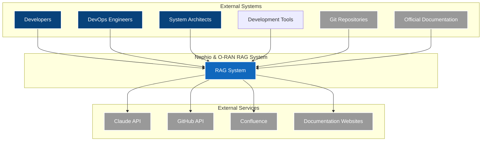
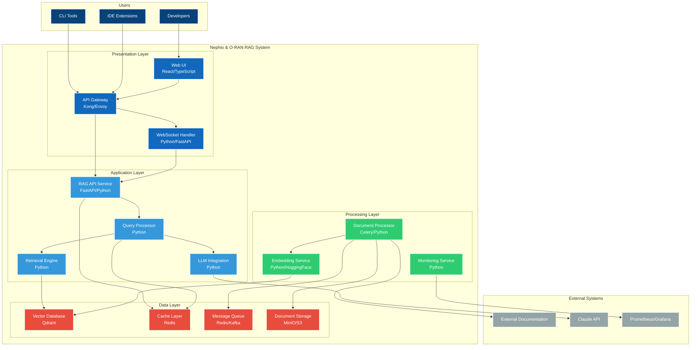
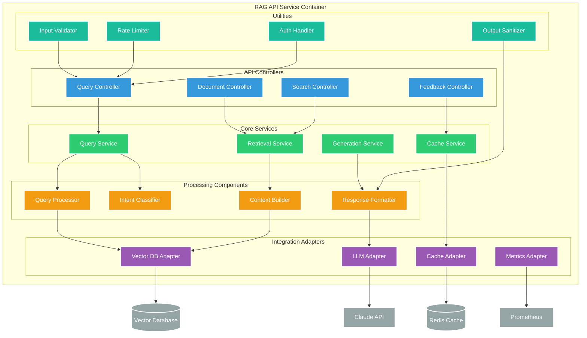
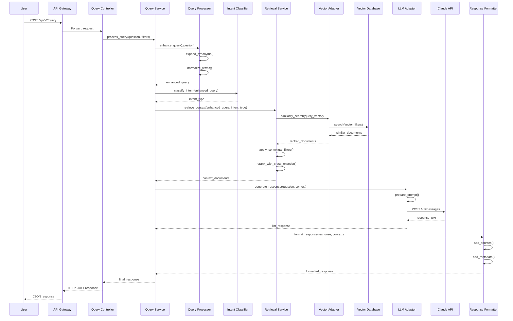
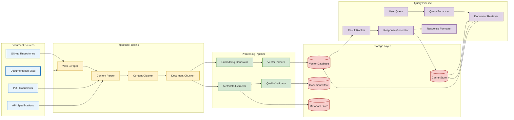
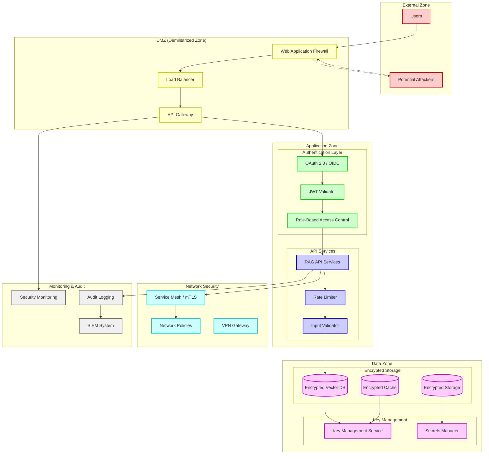

# C4 Architecture Diagrams for Nephio & O-RAN RAG System

## Overview

This document provides detailed C4 model diagrams for the comprehensive RAG system architecture. The C4 model offers a hierarchical set of diagrams to visualize software architecture at different levels of abstraction.

---

## Level 1: System Context

### Context Description

The **Nephio & O-RAN RAG System** serves as a central knowledge hub for:

- **Developers**: Building cloud-native network functions
- **DevOps Engineers**: Deploying and managing Nephio clusters
- **System Architects**: Designing O-RAN implementations

The system integrates with external documentation sources and provides intelligent query capabilities through multiple interfaces.

---

## Level 2: Container Diagram

### Container Responsibilities

#### Presentation Layer
- **Web UI**: React-based interface for interactive queries
- **API Gateway**: Request routing, authentication, rate limiting
- **WebSocket Handler**: Real-time streaming responses

#### Application Layer
- **RAG API Service**: Main API orchestrator
- **Query Processor**: Query understanding and enhancement
- **Retrieval Engine**: Multi-stage document retrieval
- **LLM Integration**: Response generation and streaming

#### Processing Layer
- **Document Processor**: Asynchronous document ingestion
- **Embedding Service**: Vector generation for documents
- **Monitoring Service**: System health and metrics

#### Data Layer
- **Vector Database**: Semantic search and similarity matching
- **Cache Layer**: Multi-level caching for performance
- **Message Queue**: Asynchronous task processing
- **Document Storage**: Raw document and metadata storage

---

## Level 3: Component Diagram - RAG API Service

---

## Level 4: Code Diagram - Query Processing Flow

---

## Data Flow Diagram

---

## Deployment Architecture

```mermaid
graph TB
    subgraph "Load Balancer Layer"
        LB[Load Balancer<br/>Kubernetes Ingress]
    end

    subgraph "Application Tier"
        subgraph "API Services"
            API1[RAG API Pod 1]
            API2[RAG API Pod 2]
            API3[RAG API Pod 3]
        end

        subgraph "Processing Services"
            PROC1[Document Processor Pod 1]
            PROC2[Document Processor Pod 2]
        end

        subgraph "Embedding Services"
            EMB1[Embedding Service Pod 1]
            EMB2[Embedding Service Pod 2]
        end
    end

    subgraph "Data Tier"
        subgraph "Vector Database Cluster"
            QDRANT1[Qdrant Node 1<br/>Primary]
            QDRANT2[Qdrant Node 2<br/>Replica]
            QDRANT3[Qdrant Node 3<br/>Replica]
        end

        subgraph "Cache Cluster"
            REDIS1[Redis Primary]
            REDIS2[Redis Replica 1]
            REDIS3[Redis Replica 2]
        end

        subgraph "Storage"
            S3[Object Storage<br/>MinIO/S3]
        end
    end

    subgraph "Monitoring & Observability"
        PROM[Prometheus]
        GRAFANA[Grafana]
        JAEGER[Jaeger]
        LOKI[Loki]
    end

    subgraph "External Services"
        CLAUDE_EXT[Claude API]
        GITHUB_EXT[GitHub API]
    end

    %% Load balancer connections
    LB --> API1
    LB --> API2
    LB --> API3

    %% API to processing connections
    API1 --> PROC1
    API2 --> PROC1
    API3 --> PROC2

    %% Processing to embedding connections
    PROC1 --> EMB1
    PROC2 --> EMB2

    %% Database connections
    API1 --> QDRANT1
    API2 --> QDRANT2
    API3 --> QDRANT3

    %% Cache connections
    API1 --> REDIS1
    API2 --> REDIS1
    API3 --> REDIS1

    %% Storage connections
    PROC1 --> S3
    PROC2 --> S3

    %% Monitoring connections
    API1 --> PROM
    API2 --> PROM
    API3 --> PROM
    PROC1 --> PROM
    PROC2 --> PROM

    %% External connections
    API1 --> CLAUDE_EXT
    API2 --> CLAUDE_EXT
    API3 --> CLAUDE_EXT
    PROC1 --> GITHUB_EXT
    PROC2 --> GITHUB_EXT

    classDef lb fill:#ff9999,stroke:#cc0000,stroke-width:2px,color:#fff
    classDef api fill:#99ccff,stroke:#0066cc,stroke-width:2px,color:#fff
    classDef processing fill:#99ff99,stroke:#00cc00,stroke-width:2px,color:#000
    classDef data fill:#ffcc99,stroke:#ff6600,stroke-width:2px,color:#000
    classDef monitoring fill:#cc99ff,stroke:#6600cc,stroke-width:2px,color:#fff
    classDef external fill:#cccccc,stroke:#666666,stroke-width:2px,color:#000

    class LB lb
    class API1,API2,API3 api
    class PROC1,PROC2,EMB1,EMB2 processing
    class QDRANT1,QDRANT2,QDRANT3,REDIS1,REDIS2,REDIS3,S3 data
    class PROM,GRAFANA,JAEGER,LOKI monitoring
    class CLAUDE_EXT,GITHUB_EXT external
```

---

## Security Architecture

---

## Integration Patterns

```mermaid
graph TB
    subgraph "RAG System Core"
        RAG_CORE[RAG Core Engine]
    end

    subgraph "Developer Tools Integration"
        subgraph "IDEs"
            VSCODE[VS Code Extension]
            INTELLIJ[IntelliJ Plugin]
            VIM[Vim Plugin]
        end

        subgraph "CLI Tools"
            KUBECTL[kubectl plugin]
            NEPHIO_CLI[Nephio CLI]
            CURL[curl/REST]
        end

        subgraph "CI/CD Integration"
            GITHUB_ACTIONS[GitHub Actions]
            GITLAB_CI[GitLab CI]
            JENKINS[Jenkins]
            TEKTON[Tekton Pipelines]
        end
    end

    subgraph "Documentation Integration"
        GITBOOK[GitBook]
        CONFLUENCE[Confluence]
        NOTION[Notion]
        SPHINX[Sphinx]
    end

    subgraph "Monitoring Integration"
        GRAFANA_DASH[Grafana Dashboards]
        KIBANA[Kibana]
        DATADOG[Datadog]
        NEWRELIC[New Relic]
    end

    subgraph "Notification Integration"
        SLACK[Slack Bot]
        TEAMS[Microsoft Teams]
        DISCORD[Discord Bot]
        EMAIL[Email Alerts]
    end

    %% IDE integrations
    VSCODE --> RAG_CORE
    INTELLIJ --> RAG_CORE
    VIM --> RAG_CORE

    %% CLI integrations
    KUBECTL --> RAG_CORE
    NEPHIO_CLI --> RAG_CORE
    CURL --> RAG_CORE

    %% CI/CD integrations
    GITHUB_ACTIONS --> RAG_CORE
    GITLAB_CI --> RAG_CORE
    JENKINS --> RAG_CORE
    TEKTON --> RAG_CORE

    %% Documentation integrations
    GITBOOK --> RAG_CORE
    CONFLUENCE --> RAG_CORE
    NOTION --> RAG_CORE
    SPHINX --> RAG_CORE

    %% Monitoring integrations
    RAG_CORE --> GRAFANA_DASH
    RAG_CORE --> KIBANA
    RAG_CORE --> DATADOG
    RAG_CORE --> NEWRELIC

    %% Notification integrations
    RAG_CORE --> SLACK
    RAG_CORE --> TEAMS
    RAG_CORE --> DISCORD
    RAG_CORE --> EMAIL

    classDef core fill:#ff6b6b,stroke:#ee5a52,stroke-width:3px,color:#fff
    classDef ide fill:#4ecdc4,stroke:#45b7aa,stroke-width:2px,color:#fff
    classDef cli fill:#45b7d1,stroke:#3a9bc1,stroke-width:2px,color:#fff
    classDef cicd fill:#96ceb4,stroke:#85b89d,stroke-width:2px,color:#000
    classDef docs fill:#feca57,stroke:#ff9f43,stroke-width:2px,color:#000
    classDef monitor fill:#ff9ff3,stroke:#f368e0,stroke-width:2px,color:#000
    classDef notify fill:#54a0ff,stroke:#2e86de,stroke-width:2px,color:#fff

    class RAG_CORE core
    class VSCODE,INTELLIJ,VIM ide
    class KUBECTL,NEPHIO_CLI,CURL cli
    class GITHUB_ACTIONS,GITLAB_CI,JENKINS,TEKTON cicd
    class GITBOOK,CONFLUENCE,NOTION,SPHINX docs
    class GRAFANA_DASH,KIBANA,DATADOG,NEWRELIC monitor
    class SLACK,TEAMS,DISCORD,EMAIL notify
```

---

## Summary

These C4 architecture diagrams provide a comprehensive view of the Nephio & O-RAN RAG system at multiple levels of detail:

1. **System Context**: Shows the system's place in the broader ecosystem
2. **Container Diagram**: Illustrates the high-level technical building blocks
3. **Component Diagram**: Details the internal structure of key containers
4. **Code Diagram**: Demonstrates runtime behavior and interactions

The diagrams emphasize:

- **Modularity**: Clear separation of concerns across layers
- **Scalability**: Horizontal scaling capabilities at each tier
- **Security**: Defense-in-depth approach with multiple security layers
- **Integration**: Extensive integration points for developer workflows
- **Observability**: Comprehensive monitoring and audit capabilities

This architecture supports the evolving needs of Nephio and O-RAN development teams while providing a robust foundation for future enhancements.